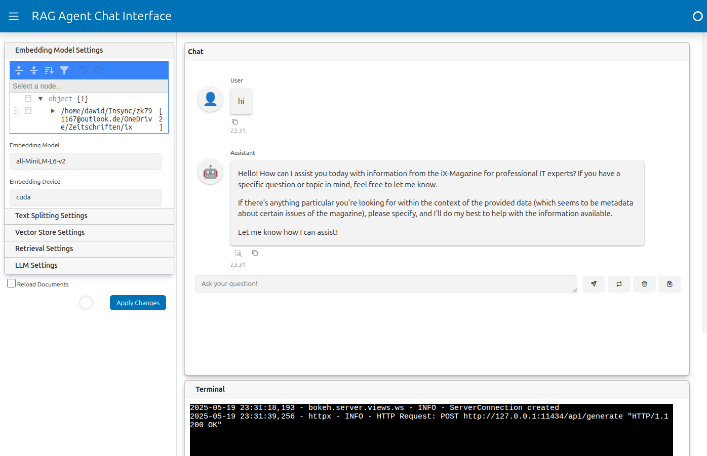

[](https://github.com/sarumaj/rag-agent/actions/workflows/release.yml)
[](https://github.com/sarumaj/rag-agent/releases/latest)
[](https://github.com/sarumaj/rag-agent/blob/main/pyproject.toml)

---

# RAG Pipeline

A powerful Retrieval-Augmented Generation (RAG) pipeline implementation that supports multiple document types, embedding models, and LLM providers.

## Features

- **Multiple Document Support**
  - PDF documents
  - Text files
  - HTML content

- **Flexible LLM Integration**
  - Ollama support (local models)
  - Hugging Face integration
  - Configurable model parameters

- **Advanced Document Processing**
  - Metadata extraction from file paths
  - Configurable text chunking
  - Duplicate detection
  - Progress tracking

- **Vector Store Features**
  - ChromaDB integration
  - Configurable embedding models
  - Multiple search strategies
  - Persistent storage

## Installation

1. Clone the repository:
```bash
git clone https://github.com/yourusername/rag-pipeline.git
cd rag-pipeline
```

2. Create and activate a virtual environment:
```bash
python -m venv venv
source venv/bin/activate  # On Windows: venv\Scripts\activate
```

3. Install dependencies:
```bash
# install from source
pip install -e .
# or install latest release from PyPI
pip install rag-agent
```

4. Install Ollama (if using local models):
```bash
curl -fsSL https://ollama.com/install.sh | sh
```

## Configuration

Create a `.env` file in the project root with your configuration:

```env
# Document source settings
PIPELINE_SOURCES='{"/path/to/your/documents": ["pdf", "mhtml"]}'

# Text splitting settings
PIPELINE_CHUNK_SIZE=1000
PIPELINE_CHUNK_OVERLAP=200

# Vector store settings
PIPELINE_PERSIST_DIRECTORY=chroma_db
PIPELINE_COLLECTION_NAME=default_collection

# Embedding model settings
PIPELINE_EMBEDDING_MODEL=all-MiniLM-L6-v2
PIPELINE_EMBEDDING_MODEL_KWARGS={"device": "cuda"}

# LLM settings
PIPELINE_LLM_PROVIDER=ollama  # or 'huggingface'
PIPELINE_LLM_MODEL=mistral
PIPELINE_LLM_MODEL_KWARGS={"temperature": 0.3}
PIPELINE_LLM_API_KEY=your_api_key  # Required for Hugging Face

# Retrieval settings
PIPELINE_SEARCH_TYPE=similarity  # or 'mmr', 'similarity_score_threshold'
PIPELINE_K=5
PIPELINE_SCORE_THRESHOLD=0.5
PIPELINE_FETCH_K=20
PIPELINE_LAMBDA_MULT=0.5
```

Refer to [pipeline config](src/rag_agent/pipeline/config.py) for more information.

## Usage

### Basic Usage

```python
from rag_agent.pipeline import RAGPipeline, Settings

async def main():
    # Initialize with default settings
    async with RAGPipeline() as pipeline:
        # Load and process documents
        documents = await pipeline.load_documents()
        processed_docs = await pipeline.process_documents(documents)
        await pipeline.update_vectorstore(processed_docs)
        
        # Setup and run query
        await pipeline.setup_retrieval_chain()
        answer = await pipeline.run("Your question here")
        print(answer)

# Run the pipeline
import asyncio
asyncio.run(main())
```

### Web UI



The project includes a modern web interface built with Panel that provides an interactive way to use the RAG pipeline:

#### Features
- **Interactive Chat Interface**
  - Real-time question answering
  - Context toggle for viewing retrieved documents
  - Chat history saving and export
  - Copy and clear functionality

- **Configuration Management**
  - Live configuration updates
  - Document source management
  - Embedding model settings
  - Text splitting parameters
  - Vector store configuration
  - Retrieval strategy options
  - LLM provider settings

- **User Experience**
  - Responsive layout with collapsible sidebar
  - Real-time notifications
  - Progress tracking
  - Error handling with detailed feedback

#### Installation

Install the UI dependencies:
```bash
pip install 'rag-agent[ui]'
```

#### Usage

Start the web interface:
```bash
python -m rag_agent.ui
```

Or specify a custom port:
```bash
python -m rag_agent.ui --port 8502
```

The interface will be available at `http://localhost:8501` (or your specified port).

### Custom Configuration

```python
config = Settings(
    pipeline_source="/path/to/documents",
    pipeline_source_type="pdf",
    pipeline_llm_provider="ollama",
    pipeline_llm_model="mixtral",
    pipeline_llm_model_kwargs={"temperature": 0.3}
)

async with RAGPipeline(config) as pipeline:
    # ... rest of the code
```

## Supported Models

### All Ollama Models
- `mistral` (7B parameters)
- `mixtral` (8x7B parameters)
- `llama2` (7B parameters)
- `codellama` (Code specialized)
- `neural-chat` (Chat optimized)
- `dolphin-mixtral` (Chat optimized)
- And many more...

### Hugging Face Models (Experimental)
- `mistralai/Mistral-7B-Instruct-v0.2`
- `meta-llama/Llama-2-7b-chat-hf`
- `malteos/gpt2-wechsel-german`
- And many more...

## Document Processing

The pipeline supports various document types and processing options:

### PDF Processing
- Uses PyMuPDF for efficient PDF processing
- Extracts text and metadata
- Configurable processing modes

### Text Processing
- Configurable chunk sizes
- Overlap control
- Metadata extraction

### HTML Processing
- Clean HTML extraction
- Structured content handling
- Metadata preservation

## iX Archive Scraper

The project includes a specialized scraper for the archive of [iX magazine issues](https://www.heise.de/ix) with the following features:

### Features
- **Automated Article Download**
  - Downloads articles in multiple formats (PDF, MHTML)
  - Preserves article metadata and structure
  - Handles authentication and session management

- **Parallel Processing**
  - Concurrent article processing
  - Configurable thread pool
  - Progress tracking with tqdm

- **Robust Error Handling**
  - Automatic retries for failed downloads
  - Graceful cleanup on interruption
  - Detailed logging

### Configuration

Add the following to your `.env` file for IX scraper configuration:

```env
# IX Scraper settings
IX_SCRAPER_BASE_URL=https://www.heise.de
IX_SCRAPER_SIGN_IN_URL=https://www.heise.de/sso/login/
IX_SCRAPER_ARCHIVE_URL=https://www.heise.de/select/ix/archiv/
IX_SCRAPER_MAX_THREADS=10
IX_SCRAPER_MAX_CONCURRENT=10
IX_SCRAPER_TIMEOUT=30
IX_SCRAPER_RETRY_ATTEMPTS=5
IX_SCRAPER_OUTPUT_DIR=~/Downloads/ix
IX_SCRAPER_USERNAME=your_username
IX_SCRAPER_PASSWORD=your_password
IX_SCRAPER_OVERWRITE=false
IX_SCRAPER_EXPORT_FORMATS=["pdf"]
```

Refer to [iX scraper config](src/rag_agent/scrapers/ix/config.py) for more information.

### Usage

```python
# pip install -e .[scraper]
from rag_agent.scrappers.ix import IXScraper, Settings

async def main():
    # Initialize with default settings
    async with IXScraper() as scraper:
        # Run the scraper to export each article separately using export configuration
        await scraper.run()

# Run the scraper
import asyncio
asyncio.run(main())
```

or 

```python
# pip install -e .[scraper]
from rag_agent.scrappers.ix import IXDownloader, Settings

async def main():
    # Initialize with default settings
    async with IXDownloader() as scraper:
        # Run the scraper to download the issues in PDF format
        await scraper.run()

# Run the scraper
import asyncio
asyncio.run(main())
```

### Export Formats

The scraper supports multiple export formats:

1. **PDF Export**
   - High-quality PDF output
   - Configurable page settings
   - Base64 encoded transfer

2. **MHTML Export**
   - Preserves web page structure
   - Includes all resources
   - Suitable for archival

### WebDriver Configuration

The scraper uses Selenium WebDriver with configurable options:
- Headless mode support
- Custom user agent
- Resource optimization
- Security settings

## Vector Store

The pipeline uses ChromaDB for vector storage with features like:
- Configurable embedding models
- Multiple search strategies
- Persistent storage
- Duplicate detection

## Contributing

1. Fork the repository
2. Create a feature branch
3. Commit your changes
4. Push to the branch
5. Create a Pull Request

## License

This project is licensed under the MIT License - see the LICENSE file for details.

## Acknowledgments

- LangChain for the RAG framework
- ChromaDB for vector storage
- Ollama for local LLM support
- Hugging Face for model hosting
- iX publishers
